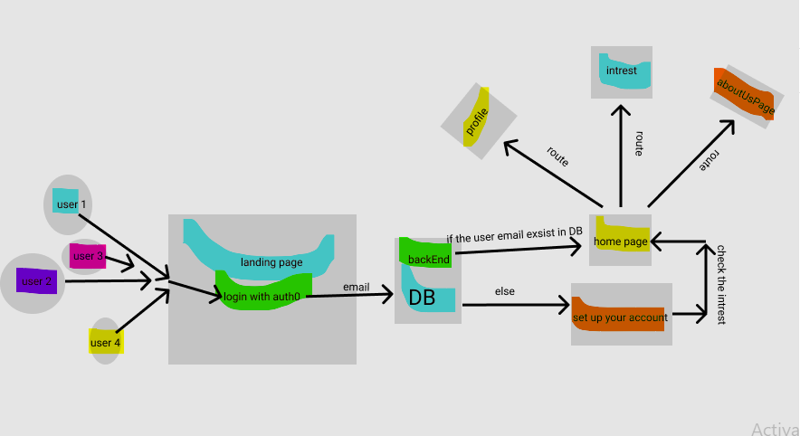

# Domain Modeling

## Software Requirements

## Vision

### What is the vision of this application?

Small social media applicatin aims to make the connection easier between the users by posting their own posts and commenting on others posts, they also can add their own intersts.

### What pain point does this project solve?

It solves The difficulty of communication between people.

### Why should we care about your application?

We are creating a platform application where you can feel free to post your opinion without getting your post deleted without Content restriction.

## Scope (In/Out)

### IN - What will your product do

Describe the individual features that your product will do.

1. User can create an account that has his/her own information.

2. User can pick his/her own interst to be viewed.

3. User can write his/her own words in a post.

4. User can see others posts.

5. User will be able to comment on others posts.

6. User will be able to like others posts.

### OUT - What will your product not do

1. User cant post any picture.

2. User cant chat or call others.

## Feature tasks

1. The User will be able to add Frindes.

2. The user wii be able to add pictuers.

3. The user wii be able to chat with others.

## User Stories

**Title**: User Story : As a user i would like to login and choose my intersts and see them at the home page in the website.

**Title**: User Story : As a user I would like to checkout my profile and do edit on it.

**Title**:  User Story : As a user i would like to see the public posts at the Home page.

**Title**:  User Story : As a user i would like to write my opinion in a post and share it with others on my profile.
